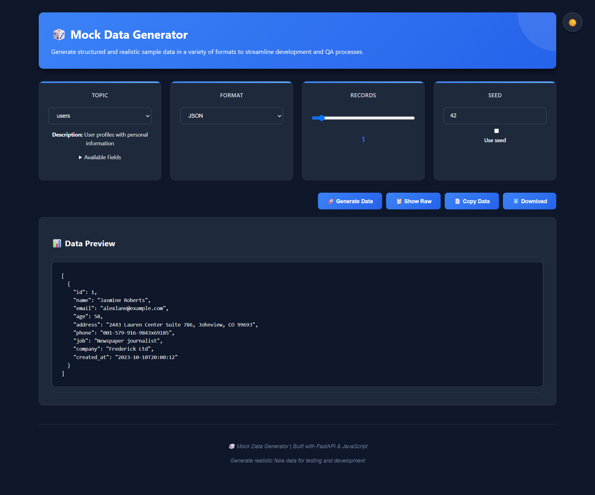

# Mock Data Generator 🎲

A powerful web application to generate realistic fake data in multiple formats for testing and development purposes.

## 📸 Application Overview

### Main Interface


## 🚀 Features

- **12 Predefined Topics**: Users, Products, Orders, Employees, Financial, Healthcare, Education, Real Estate, Social Media, IoT Sensors, Logistics, Banking
- **Custom Topic Support**: Define your own fields and generate custom data
- **15 Output Formats**: JSON, XML, CSV, YAML, Parquet, TSV
- **Up to 1000 Records**: Generate large datasets for testing
- **Download & Copy**: Easy data export options
- **Reproducible Data**: Use seeds for consistent data generation
- **Real-time Preview**: See your data before downloading

## 🛠️ Tech Stack

- **Backend**: FastAPI (Python)
- **Frontend**: Streamlit
- **Data Generation**: Faker library
- **Data Processing**: Pandas
- **Format Support**: Multiple specialized libraries

## 🚀 Quick Start

1. **Clone the repository**
   ```bash
   git clone <repository-url>
   cd mock-data-generator
   ```

2. **Install dependencies**
   ```bash
   pip install -r requirements.txt
   ```

3. **Run the application**
   ```bash
   python run.py
   ```

4. **Access the application**
   - Frontend: http://localhost:8501
   - API Documentation: http://localhost:8000/docs

## 📋 Available Topics

### Core Business Data
| Topic | Description | Sample Fields |
|-------|-------------|---------------|
| **Users** | Personal information, contact details | name, email, phone, address |
| **Products** | E-commerce product data | title, price, category, description |
| **Orders** | Transaction and order data | order_id, amount, status, date |
| **Employees** | HR and employee records | employee_id, department, salary, hire_date |

### Specialized Data
| Topic | Description | Sample Fields |
|-------|-------------|---------------|
| **Financial** | Banking and transaction data | account_number, balance, transaction_type |
| **Healthcare** | Patient and medical records | patient_id, diagnosis, treatment, date |
| **Education** | Student and course data | student_id, course, grade, semester |
| **Real Estate** | Property listings | address, price, bedrooms, area |
| **Social Media** | Posts and interactions | post_id, content, likes, shares |
| **IoT Sensors** | Sensor readings and data | sensor_id, temperature, humidity, timestamp |
| **Logistics** | Shipping and delivery data | tracking_number, status, origin, destination |
| **Banking** | Account and transaction data | account_type, balance, interest_rate |

## 🎛️ API Endpoints

| Method | Endpoint | Description | Response |
|--------|----------|-------------|----------|
| `GET` | `/` | Health check | Status message |
| `GET` | `/topics` | Get available topics | List of topics |
| `GET` | `/formats` | Get supported formats | List of formats |
| `POST` | `/generate` | Generate mock data | Generated data |
| `POST` | `/download` | Download generated data | File download |

## 🔧 Usage Examples

### Generate User Data (JSON)
```python
import requests

payload = {
    "topic": "users",
    "format": "JSON",
    "num_records": 100,
    "seed": 42
}

response = requests.post("http://localhost:8000/generate", json=payload)
data = response.json()
```

### Custom Topic Generation
```python
payload = {
    "topic": "custom",
    "format": "CSV",
    "num_records": 50,
    "custom_fields": ["product_name", "price", "category", "in_stock"]
}

response = requests.post("http://localhost:8000/generate", json=payload)
```

### Using cURL
```bash
curl -X POST "http://localhost:8000/generate" \
     -H "Content-Type: application/json" \
     -d '{
       "topic": "products",
       "format": "JSON",
       "num_records": 10,
       "seed": 123
     }'
```

## 🌟 Key Features

### Multiple Format Support
Export your generated data in 15 different formats to meet various integration needs - from simple CSV files to advanced formats like Parquet and HDF5.

### Seed-based Generation
Ensure reproducible data generation across environments by using the same seed value. Perfect for testing scenarios where consistent data is required.

### Real-time Preview
See your generated data immediately in the web interface before deciding to download or copy it.

### Custom Field Support
Not finding the right predefined topic? Create your own custom data schema by specifying field names and let the system generate appropriate data.

## 🙏 Acknowledgments

- [Faker](https://faker.readthedocs.io/) - For realistic fake data generation
- [FastAPI](https://fastapi.tiangolo.com/) - For the robust API framework
- [HTML, CSS, JavaScript](https://www.w3schools.com/) - For the intuitive frontend interface

## 💡 Future Enhancements

- [ ] Database export options (SQL, MongoDB)
- [ ] API key authentication
- [ ] Data relationship modeling
- [ ] Batch processing for large datasets
- [ ] Custom data templates
- [ ] Data validation rules
- [ ] Export scheduling
- [ ] More language localizations

---

**Happy Data Generation! 🎲**
